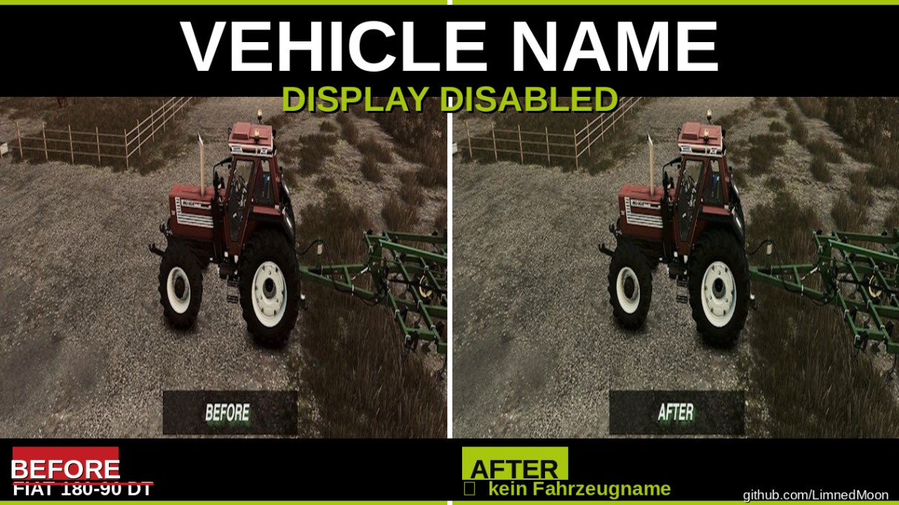

## English Description:
This mod Removes the vehicle name notification that appears at the bottom of the screen when entering a vehicle.

## German Description:
Entfernt die Fahrzeugname-Einblendung, die beim Einsteigen in ein Fahrzeug unten auf dem Bildschirm erscheint.

## Tested on:
Farming Simulator 25 / Version 1.16.0.3

## Showcase

## Screenshots:

